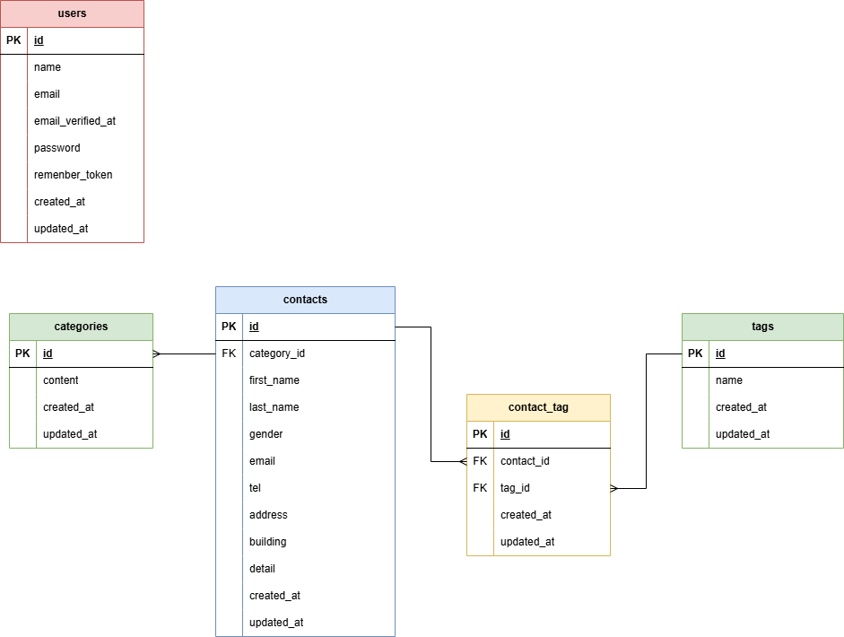

# [COACHTECH お問い合わせフォーム]

## 概要
###プロジェクトの目的

トラブル対応にとどまらず、バックオフィス運用の最適化とマーケティングへの貢献を目指します。
* **顧客体験（CX）の向上**: スピーディで的確なサポートによる顧客満足度の向上
* **業務効率化とコスト削減**: 一元管理による対応漏れ・二重対応の防止、過去の問い合わせの検索性向上
* **データの蓄積と活用**: 問い合わせ内容をデータ化し、今後の商品開発やサービス改善にフィードバックする

###一般ユーザー向け機能（画面）

ログイン不要で、誰でも簡単にお問い合わせを送信できる機能です。
* **お問い合わせ送信機能**: 名前、メールアドレス、属性情報、内容を入力して送信
* **カテゴリー・タグ選択機能**: お問い合わせ内容に応じたカテゴリー（1つ）と、詳細なタグ（複数）の指定

###管理者向け機能(画面)

送信されたお問い合わせを安全に一元管理・分析するための機能です。
* **認証機能**: 管理者アカウントによるログイン/ログアウト（セキュリティ対策）
* **お問い合わせ検索・一覧表示**: キーワード、カテゴリー、対応状況、日付などによる絞り込み検索
* **データエクスポート機能**: 検索結果に応じたお問い合わせデータのCSV/Excel出力
* **マスタ管理機能**: 運用に合わせたタグの追加・編集・削除

###公開API(システム・開発者向け)

フロントエンド（SPAやモバイルアプリ）や、外部システムとの連携を想定したAPIエンドポイントです。
* **お問い合わせ登録API**: 外部のフロントエンドやスマートフォンアプリから、ログインなしでお問い合わせを登録するため。
* **お問い合わせ一覧・詳細取得API**: 管理者用モバイルアプリでの閲覧や、外部の顧客管理システムへのデータ自動連携のため。
* **お問い合わせ削除API**: 一定期間が過ぎたデータの自動クリーンアップ（バッチ処理連携）のため。


## ER図




## 環境構築手順

###前提条件
* Docker Desktop がインストールされ、起動していること
* Git がインストールされていること
* ※エイリアス設定（`sail` だけの省略コマンド）の説明は省略しています。

---

###1. リポジトリのクローン  
ターミナルで以下のコマンドを実行し、プロジェクトをローカルにコピーします。
```bash
git clone https://github.com/en6113/contact-form
cd contact-form
```

###2. .env ファイルの作成と確認

2-1. 設定ファイルの雛形をコピーして .env ファイルを作成します。
```bash
cp .env.example .env
```

2-2. .env ファイルを開き、データベース接続情報が以下と一致していることを確認してください。
```bash
DB_CONNECTION=mysql
DB_HOST=mysql
DB_PORT=3306
DB_DATABASE=laravel
DB_USERNAME=sail
DB_PASSWORD=password
```

> 重要: DB_HOST は localhost や 127.0.0.1 ではなく、Dockerコンテナ名である mysql を指定します。

###3．バックエンドの準備

3-1. 依存パッケージ（Composer）をインストールします。
```bash
docker run --rm \
    -u "$(id -u):$(id -g)" \
    -v "$(pwd):/var/www/html" \
    -w /var/www/html \
    -e COMPOSER_CACHE_DIR=/tmp/composer_cache \
    laravelsail/php82-composer:latest \
    composer install
```

3-2. Dockerコンテナをバックグラウンドで起動します。
```bash
./vendor/bin/sail up -d
```

3-3. アプリケーションキー（暗号化用の鍵）を自動生成します。
```bash
./vendor/bin/sail artisan key:generate
```

###4．データベースの準備  
以下のコマンドでテーブルを作成し、初期(テスト)データを投入します。
```bash
./vendor/bin/sail artisan migrate --seed
```

###5．フロントエンドの準備  
フロントエンドの依存パッケージ（Vite, Tailwind CSSなど）をインストールし、起動します。
```bash
./vendor/bin/sail npm install
./vendor/bin/sail npm run dev
```
> 注意: sail npm run dev は実行したまま（ターミナルを開いたまま）にしておく必要があります。

###6．動作確認  
ブラウザで以下のURLにアクセスできれば構築完了です。
* **アプリケーション**: http://localhost
* **phpMyAdmin** (データベース管理): http://localhost:8080


## 使用技術
- **OS** : Linux
- **PHP** : 8.2
- **Laravel** : 10.x
- **DB** : MySQL 8.0
- **Webサーバー** : Nginx
- **フロントエンド** : Vite, Tailwind CSS ^3.4.0
- **開発ツール** : Docker, Laravel Sail, phpMyAdmin


## APIエンドポイント一覧

| メソッド | パス | 概要 |
| :--- | :--- | :--- |
| GET | `/api/v1/contacts` |お問い合わせ一覧（検索・ページネーション付き）|
| GET | `/api/v1/contacts/{contact}` | お問い合わせ詳細（カテゴリ・タグ含む）|
| POST | `/api/v1/contacts` | お問い合わせ新規作成 |
| PUT | `/api/v1/contacts/{contact}` | お問い合わせ更新 |
| DELETE | `/api/v1/contacts/{contact}` | お問い合わせ削除 |

>重要:認証機能は現時点では実装していません

## 開発環境URL

http://localhost


## 作成者

圓　まり
